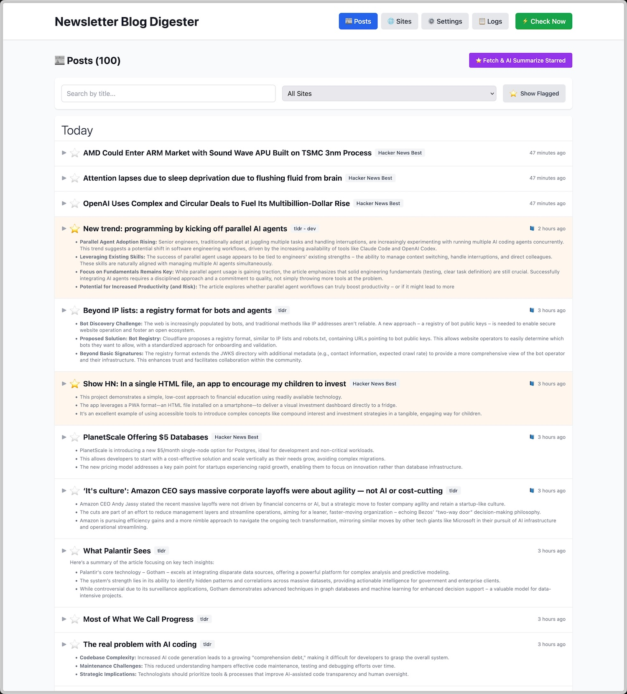
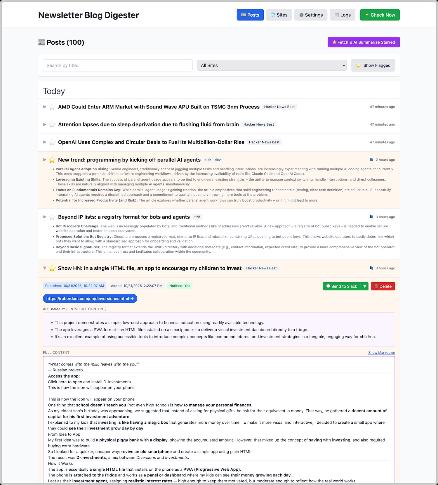
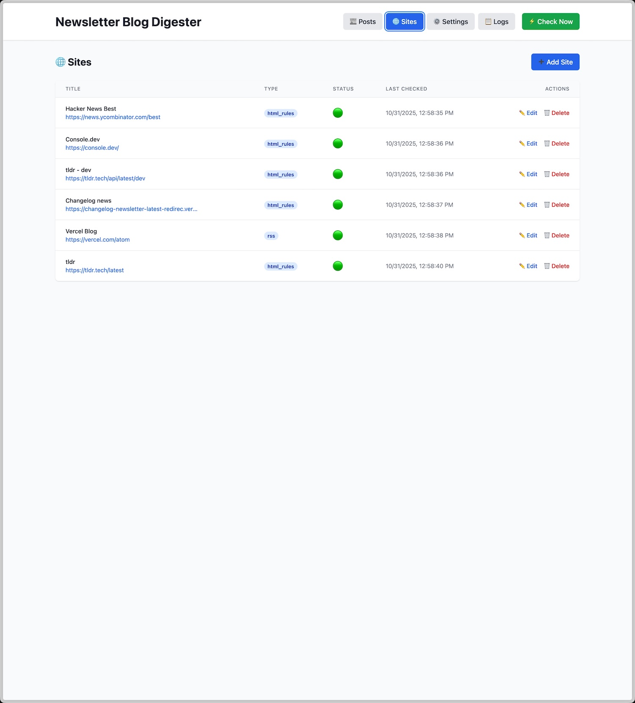
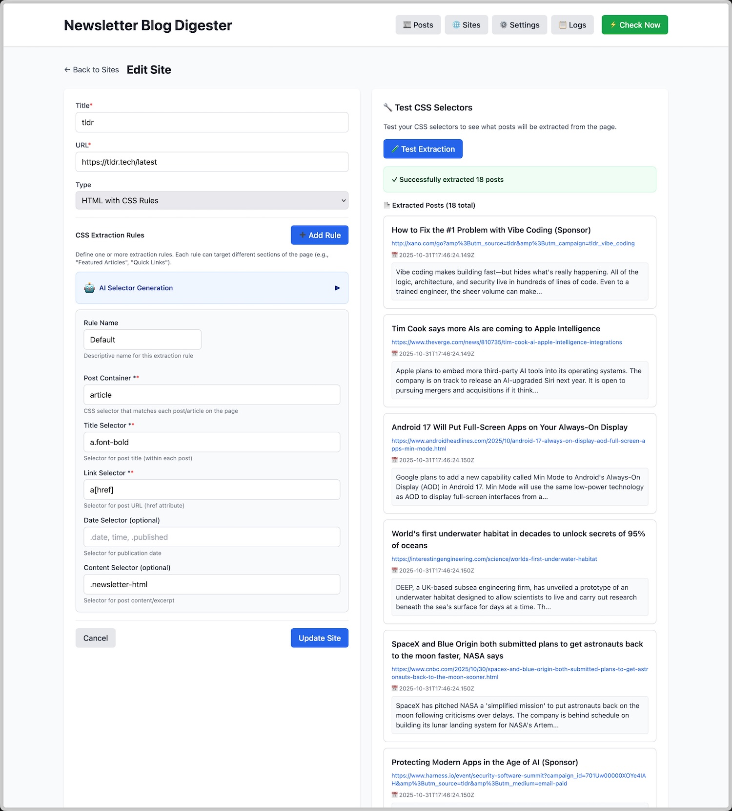
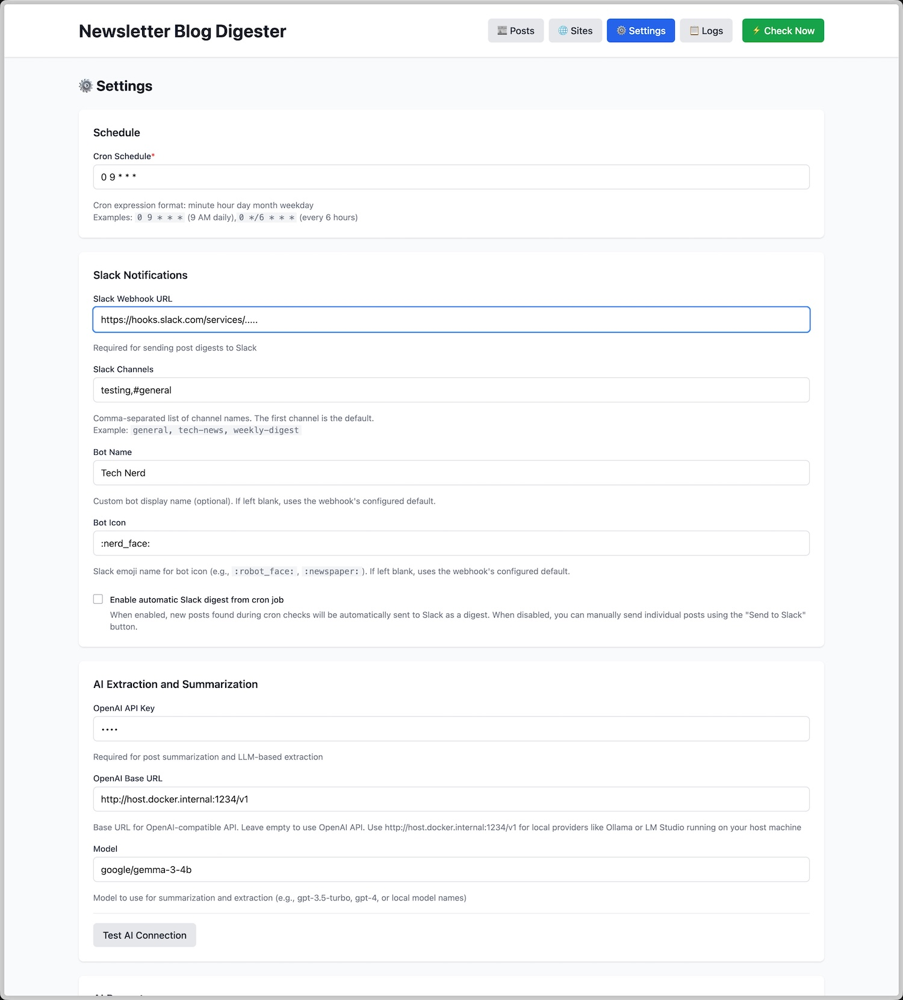
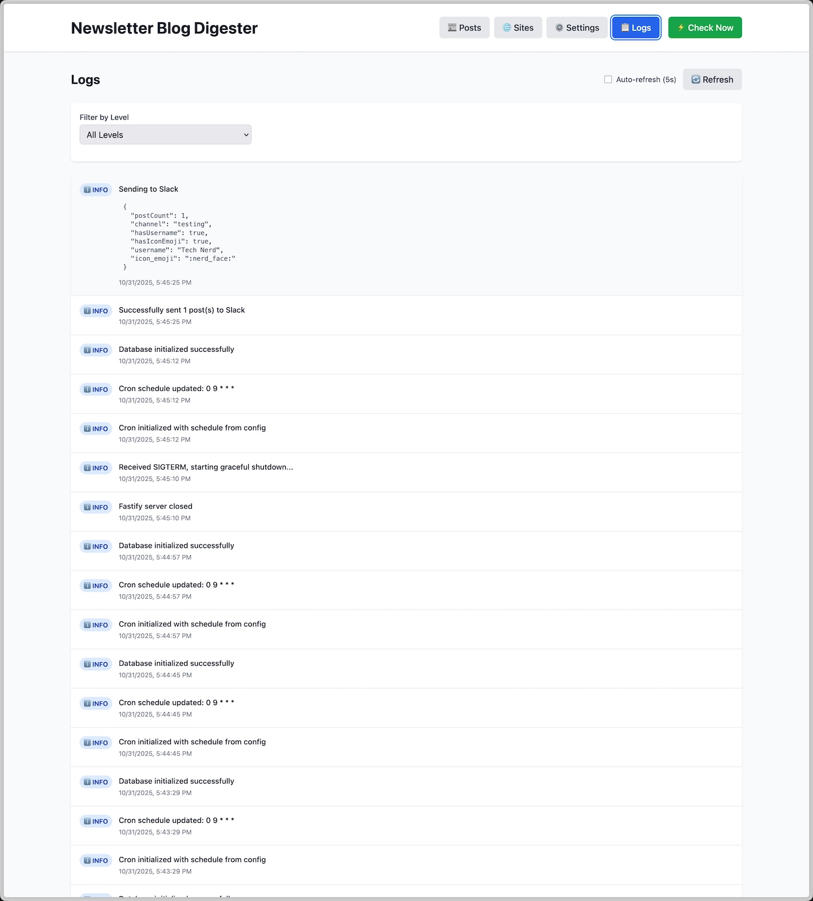

# Newsletter & Blog Digester

A small application that periodically checks websites/blogs, summarizes new
posts using OpenAI, and sends digests to Slack.

Here is what it looks like:

<table>
  <tr>
    <td width="33%" align="center">
      <a href="screenshots/1-posts.jpg">
        
      </a>
      <br>
      <strong>Posts View</strong><br>
      Browse and manage all extracted posts with expandable cards showing summaries and content
    </td>
    <td width="33%" align="center">
      <a href="screenshots/2-post-detail-and-actions.jpg">
        
      </a>
      <br>
      <strong>Post Details & Actions</strong><br>
      View full post details, mark as read/unread, flag posts, and delete individual items
    </td>
    <td width="33%" align="center">
      <a href="screenshots/3-sites.jpg">
        
      </a>
      <br>
      <strong>Sites Management</strong><br>
      Manage RSS feeds and websites with support for multiple extraction methods
    </td>
  </tr>
  <tr>
    <td width="33%" align="center">
      <a href="screenshots/4-site-configuration.jpg">
        
      </a>
      <br>
      <strong>Site Configuration</strong><br>
      Configure extraction rules with CSS selectors or LLM-based extraction for complex sites
    </td>
    <td width="33%" align="center">
      <a href="screenshots/5-settings.jpg">
        
      </a>
      <br>
      <strong>Settings</strong><br>
      Configure OpenAI API, Slack notifications, cron schedule, and customization options
    </td>
    <td width="33%" align="center">
      <a href="screenshots/6-logs.jpg">
        
      </a>
      <br>
      <strong>Application Logs</strong><br>
      Monitor system activity with filterable logs showing extraction jobs and errors
    </td>
  </tr>
</table>

## Quick Start

### Local Development

```bash
# Install dependencies
npm install

# Run tests
npm test

# Run tests in watch mode
npm run test:watch

# Check code formatting
npm run format:check

# Format code
npm run format

# Start server
npm start

# Start with auto-reload
npm run dev
```

Server will be available at: **http://localhost:5566**

### Docker Development

```bash
# Start with Docker Compose
docker compose up

# Stop
docker compose down

# View logs
docker compose logs -f
```

## Available Scripts

| Script                  | Description                        |
| ----------------------- | ---------------------------------- |
| `npm start`             | Start server in production mode    |
| `npm run dev`           | Start with nodemon (auto-reload)   |
| `npm test`              | Run all tests                      |
| `npm run test:watch`    | Run tests in watch mode            |
| `npm run test:coverage` | Run tests with coverage report     |
| `npm run format`        | Format all code                    |
| `npm run format:check`  | Check formatting without changes   |
| `npm run pre-commit`    | Run format + tests (used by Husky) |

## Database Schema

### Tables Created

- **sites**: RSS feeds and websites to monitor
- **posts**: Extracted posts from sites
- **config**: Application configuration
- **logs**: Application logs

## Configuration

Default configuration values are seeded automatically:

- **schedule**: `0 9 * * *` (9 AM daily)
- **openai_api_key**: (empty, to be configured)
- **slack_webhook_url**: (empty, to be configured)
- **prompt_summarization**: Default summarization prompt
- **prompt_html_extract_base**: Default HTML extraction prompt
- **cleanup_content_days**: 7 days
- **cleanup_delete_days**: 365 days

## Testing

Tests use:

- **uvu**: Fast, lightweight test runner
- **sinon**: Mocking library for external APIs
- **c8**: Code coverage tool

Test files: `src/server/__tests__/*.test.js`

## Code Quality

### Formatting

- **dprint** (Rust-based formatter)
- 10-100x faster than Prettier
- Zero npm dependencies
- Configured in `dprint.json`

### Pre-commit Hooks

Automatically runs before each commit:

1. Formats all code with dprint
2. Runs all tests with uvu
3. Blocks commit if either fails

To bypass (use sparingly): `git commit --no-verify`

## Tech Stack

- **Runtime**: Node.js 20
- **Framework**: Fastify
- **Database**: SQLite (better-sqlite3)
- **Testing**: uvu + sinon + c8
- **Formatting**: dprint
- **Git Hooks**: Husky
- **Container**: Docker Compose
- **Frontend**: Preact + HTM

## License

MIT
